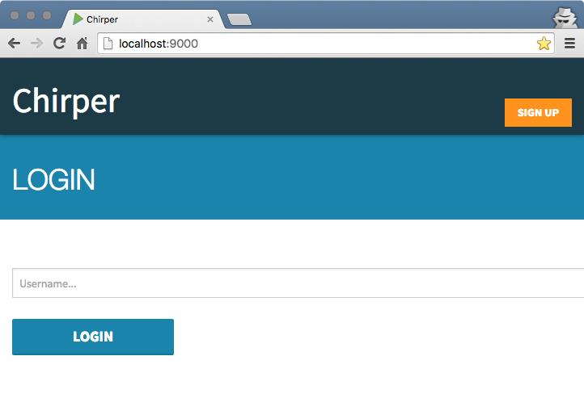

# Lagom Hands-On-Development

Lagom のサンプルプロジェクト [Chirper](https://github.com/lagom/activator-lagom-java-chirper)(Twitterライクなアプリケーション) に「お気に入り」機能を追加実装するハンズオンです。

[](https://gitter.im/negokaz/lagom-hands-on-development?utm_source=badge&utm_medium=badge&utm_campaign=pr-badge)

## このハンズオンで必要なもの

* インターネット環境
* [Google Chrome](https://www.google.co.jp/chrome/browser/desktop/)
* [Advanced REST client](https://chrome.google.com/webstore/detail/advanced-rest-client/hgmloofddffdnphfgcellkdfbfbjeloo/) (Chrome アプリ)
* ターミナル (CUI)
* [git](https://git-scm.com/)
* [JDK8](http://www.oracle.com/technetwork/java/javase/downloads/index.html)

## 最小動作環境

* CPU: 2Core
* RAM: 4GB

## 事前準備

本番までに必ず実施しておいてください。

### 必要時間の目安
* 1時間

途中、ファイルのダウンロードが行われるため、ネットワークの状況によってはこれ以上の時間がかかる場合があります。

ダウンロードされるのは開発環境(Activator UI)とハンズオン用プロジェクトが依存するライブラリです。
これらは `activator ui` と `activator runAll` のコマンドを実行したときにダウンロードされます。

### 手順

* Java のバージョンが1.8系になっているか確認してください

    ```bash
    $ java -version
    java version "1.8.0_74"
    Java(TM) SE Runtime Environment (build 1.8.0_74-b02)
    Java HotSpot(TM) 64-Bit Server VM (build 25.74-b02, mixed mode)
    $ javac -version
    javac 1.8.0_74
    ```
    JDK8をインストールしたにも関わらず、1.8系になっていない場合はJDK8にパスが通っているか確認してください。
* ターミナルで任意のディレクトリの移動し、リポジトリをクローンします

    ```bash
    $ cd ~/workspace
    $ git clone https://github.com/negokaz/lagom-hands-on-development.git
    ```

* プロジェクトのディレクトリに移動し、開発環境を起動します

    ※ Windows の場合、パスの区切り文字は`\`です。(例: `bin\activator`)

    ```bash
    $ cd lagom-hands-on-development
    $ bin/activator ui # bin には移動せず実行してください
    ```
    自動的に [http://localhost:8888](http://localhost:8888) が開き、コードが閲覧できるようになります。(例:  [FavoriteService.java](http://127.0.0.1:8888/app/lagom-hands-on-development/#code/favorite-api/src/main/java/sample/chirper/favorite/api/FavoriteService.java))

    確認できたらターミナル上で`Ctrl + C`を押して終了します。

    -----

    ※ 依存ライブラリのダウンロードがバックグラウンドで行われるため、ブラウザが開くまで時間がかかる場合があります。(最大30分程度)
    ダウンロード中はログなどが出力されないため、フリーズしているように見えますが、少し待ってみてください。

    -----

* 別のターミナルを開き、アプリケーションを起動します

    ```bash
    $ cd lagom-hands-on-development
    $ bin/activator runAll
    ....
    # ↓ のログが表示されると起動完了です
    [info] (Services started, use Ctrl+D to stop and go back to the console...)
    ```

    [http://localhost:9000](http://localhost:9000) に移動し、下記のような画面が表示されると起動成功です。
    

    確認できたらターミナル上で`Ctrl + D`を押して終了します。

## ハンズオンを始める

* Activator UI を起動します

    ```bash
    $ cd lagom-hands-on-development
    $ bin/activator ui
    ```

* [チュートリアル](http://127.0.0.1:8888/app/lagom-hands-on-development/#tutorial/0) を確認し、スタッフの指示を待って下さい。


### Activator UI が起動しない場合

下記のようなメッセージがターミナルに表示されていますか？
```
This application is already running (Or delete ../lagom-hands-on-development/RUNNING_PID file).
```
表示されている場合は RUNNING_PID ファイルを削除してから再度 Activator UI を起動しなおしてください。
```bash
rm RUNNING_PID
```
